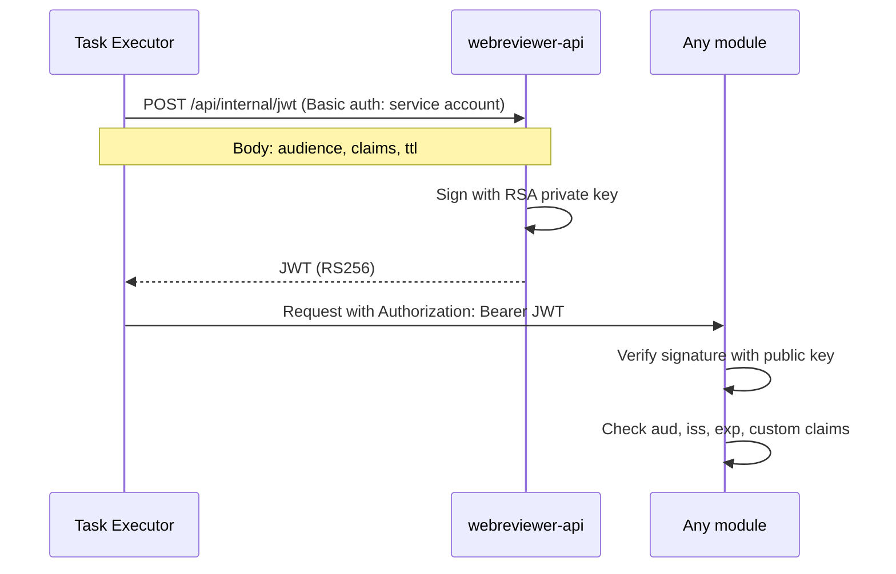

# JWT token creation and validation endpoint
_Exported on 6/16/2026 at 10:26:57 GMT+3 from Cursor (3.7.21)_

---

**User**

can it be implemented an end point accesible with an service account in webreviewer-api which create JWT tockens for all other modules and the other module can validate that tockens using their public key ?

---

**Cursor**

Exploring how JWT issuance and service-account auth work across the codebase so we can give a concrete answer.


Yes — this is feasible, and it would be a solid improvement over how Content Fusion handles service-to-service JWTs today. The codebase already has pieces of this pattern, but not a unified asymmetric (public-key) model.

## What exists today

The platform uses **symmetric HMAC secrets** (HS512), not RSA/EC public-key signing:

| Token purpose | Issuer | Secret env var |
|---|---|---|
| Job start + callbacks | `webreviewer-api` (`JobJwtTokenIssuer`) | `job_jwt_secret` |
| AI proxy org tokens | `webreviewer-api` (`AiProxyOrganizationServiceAccountTokenIssuer`) | `ai_proxy_jwt_secret` |
| Executor ↔ publishing-main | `publishing-main` (`JwtService`) | `jwt.task.executor.auth.secret` |
| Git checkout tokens | `publishing-main` | `documents-storage jwt secret` |
| Documents storage user auth | `documents-storage` | `jwt.secret` |

There is already a **service-account → JWT endpoint** for one use case:

```43:57:webreviewer-api/src/main/java/com/oxygenxml/fusion/admin/rest/AdminOrganizationJwtController.java
  @GET
  @Path("{orgId}")
  @Produces(MediaType.TEXT_PLAIN)
  public Response issueOrganizationToken(@PathParam("orgId") int organizationId) {
    // ...
    if (user.getServiceAccountRole() != User.ServiceAccountRole.TASK_EXECUTOR_SERVICE) {
      throw new NotAllowedException("Only task-executor service account can obtain organization JWT tokens");
    }

    String token = tokenIssuer.issueForOrganization(organizationId);
    return Response.ok(token).build();
  }
```

Service accounts authenticate via **Basic auth** (`AdminBasicAuthFilter` + `ServiceAccountToken`), and roles are defined in `User.ServiceAccountRole` (`taskexecutor`, `publishingmain`, `validation`, etc.).

## Proposed centralized design



### 1. Issuance endpoint (webreviewer-api)

```
POST /api/internal/service-jwt
Authorization: Basic <service-account-credentials>
Content-Type: application/json

{
  "audience": "documents-storage-git",
  "purpose": "publishing-checkout",
  "claims": { "projectIds": ["proj-1"], "organizationId": 42 },
  "ttlSeconds": 1800
}
```

- Protected by existing service-account Basic auth (same as `/api/admin/org-jwt`).
- Each service account role is allowed only certain audiences/purposes (e.g. `taskexecutor` can request `documents-storage-git` checkout tokens, but not user-session tokens).
- `webreviewer-api` holds the **private key**; only it can sign.

### 2. Public key distribution

Two common options:

**A. JWKS endpoint (recommended)**

```
GET /.well-known/jwks.json   (or /api/internal/jwks)
```

Returns standard JSON Web Key Set. Modules fetch at startup (with caching) or validate using a configured public key PEM.

**B. Deploy-time config**

Each module gets the public key PEM in its config (simpler, no runtime dependency on webreviewer-api for verification).

### 3. Token validation in other modules

Each module only needs the **public key** — no shared signing secrets:

```java
Jwts.parser()
    .verifyWith(publicKey)
    .requireIssuer("content-fusion")
    .requireAudience("documents-storage-git")
    .build()
    .parseSignedClaims(token);
```

Standard claims to enforce:

- `iss`: `"content-fusion"` (or `"webreviewer-api"`)
- `aud`: target module (`"documents-storage-git"`, `"publishing-main"`, `"webreviewer-api"`, …)
- `sub`: calling service account role
- `exp` / `iat`: always set
- `kid` in header: for key rotation

## Why this is better than today

| Today | Centralized asymmetric |
|---|---|
| Many shared secrets to rotate and keep in sync | One private key in webreviewer-api; modules only hold public key |
| Each module can sign tokens if it has the secret | Only webreviewer-api can sign; modules can only verify |
| Publishing-main mints its own Git tokens | Any service requests tokens from a single authority |
| Custom header-stripping in `JwtUtil` | Standard full JWT format everywhere |

## Migration considerations

This is a **non-trivial refactor**, not a small add-on:

1. **Replace multiple issuers** — `JobJwtTokenIssuer`, publishing-main `JwtService.generateProjectGitAccessToken()`, etc. would either move to the central endpoint or stay temporarily during migration.

2. **Update all validators** — documents-storage, publishing-main, publishing-executor, validation-service each need RS256 verification instead of (or alongside) HMAC secrets.

3. **Network hop** — today the executor gets Git tokens from publishing-main locally; with central issuance it would call webreviewer-api (or you keep publishing-main as a thin proxy). Your `PublishingMainGitAccessTokenClient` pattern could be reused.

4. **Availability** — modules must verify offline with the cached public key; they should not call webreviewer-api on every request.

5. **Key rotation** — support multiple keys in JWKS with `kid`; rotate without downtime.

6. **Backward compatibility** — run both HMAC and RS256 during transition, or do a coordinated deploy.

## Practical recommendation

**Phase 1 — foundation**

- Add RSA key pair + JWKS endpoint in webreviewer-api
- Add `CentralJwtTokenIssuer` with audience/purpose allowlists per service account role
- Add issuance endpoint behind Basic auth

**Phase 2 — first consumer**

- Migrate one flow (e.g. documents-storage Git checkout tokens) to central issuance + public-key validation
- Keep old HMAC path as fallback briefly

**Phase 3 — consolidate**

- Migrate job callbacks, AI proxy tokens, executor auth
- Remove redundant secrets from env configs

---

**Bottom line:** Yes, a webreviewer-api endpoint authenticated by service account that mints JWTs for all modules, with modules validating via public key, is the right long-term architecture. You already have the service-account auth plumbing and one org-JWT endpoint; the main work is moving from scattered HMAC secrets to a single RS256 issuer plus JWKS, and migrating each module’s validators.

If you want to proceed, I can sketch the concrete API contract (audiences, claims per use case) or start with Phase 1 in the codebase.

---

**User**

sketch the api

---

**Cursor**

Sketching a concrete API aligned with existing service accounts, audiences, and token flows in the codebase.


# Central JWT API — Sketch

A single **token authority** in `webreviewer-api`. Service accounts authenticate with Basic auth; modules validate tokens with a **public key** (JWKS or PEM).

---

## Principles

| Rule | Detail |
|------|--------|
| **Only webreviewer-api signs** | RS256 (or ES256); private key never leaves the API |
| **Modules only verify** | Public key via JWKS or config |
| **Audience-scoped** | Every token has exactly one `aud` — the consuming service |
| **Purpose-scoped** | `purpose` claim selects the authorization policy inside the target module |
| **Caller identity** | `sub` = service account role (`taskexecutor`, `publishingmain`, …) |
| **No custom header stripping** | Full standard JWT (`header.payload.signature`) |

**Issuer:** `iss` = `"content-fusion"` (fixed)

---

## 1. JWKS — public key discovery

Unauthenticated (or optionally restricted to internal network).

```
GET /.well-known/jwks.json
```

**Response `200`**

```json
{
  "keys": [
    {
      "kty": "RSA",
      "use": "sig",
      "alg": "RS256",
      "kid": "cf-jwt-2026-01",
      "n": "<base64url modulus>",
      "e": "AQAB"
    }
  ]
}
```

- Multiple keys supported for rotation; active signing key identified by `kid` in JWT header.
- Consumers cache keys (e.g. 24h) and refresh on unknown `kid`.

**Alternative for air-gapped / Enterprise installs:**

```
GET /api/internal/jwt/public-key
```

Returns PEM:

```
-----BEGIN PUBLIC KEY-----
...
-----END PUBLIC KEY-----
```

---

## 2. Token issuance — main endpoint

Service-account authenticated (same mechanism as today’s `/api/admin/org-jwt`).

```
POST /api/internal/jwt
Authorization: Basic <service-account-credentials>
Content-Type: application/json
```

### Request body

```json
{
  "audience": "documents-storage-git",
  "purpose": "publishing-checkout",
  "claims": {
    "projectIds": ["proj-abc"],
    "organizationId": 42,
    "taskId": "build-99"
  },
  "ttlSeconds": 1800
}
```

| Field | Required | Description |
|-------|----------|-------------|
| `audience` | yes | Target module; see catalog below |
| `purpose` | yes | Authorization intent within that audience |
| `claims` | no | Purpose-specific claims (validated server-side) |
| `ttlSeconds` | no | Override default TTL; capped per purpose |

### Response `200`

```json
{
  "token": "eyJhbGciOiJSUzI1NiIs...",
  "tokenType": "Bearer",
  "expiresAt": "2026-06-16T14:30:00Z",
  "kid": "cf-jwt-2026-01"
}
```

- `token` is the **raw JWT** (no `Bearer ` prefix); callers add the prefix when sending.
- `expiresAt` is informational; consumers must still validate `exp`.

### Errors

| Status | When |
|--------|------|
| `401` | Missing/invalid Basic auth |
| `403` | Authenticated service account not allowed for this `audience` + `purpose` |
| `400` | Invalid/missing claims, unknown audience/purpose, TTL over cap |
| `404` | Feature disabled (same pattern as `ADMIN_ORG_JWT_ENDPOINT`) |

```json
{
  "error": "forbidden",
  "message": "Service account 'validation' cannot issue tokens for audience 'documents-storage-git'"
}
```

---

## 3. Convenience endpoints (optional)

Thin wrappers over `POST /api/internal/jwt` for common cases — same auth, less boilerplate.

### Org AI-proxy token (replaces `/api/admin/org-jwt/{orgId}`)

```
POST /api/internal/jwt/ai-proxy
Authorization: Basic taskexecutor:...

{ "organizationId": 42 }
```

Equivalent to:

```json
{
  "audience": "webreviewer-api",
  "purpose": "org-service-account",
  "claims": { "organizationId": 42, "service": "task_executor" }
}
```

### Git checkout token

```
POST /api/internal/jwt/git-checkout
Authorization: Basic taskexecutor:... | publishingmain:...

{
  "projectIds": ["proj-abc", "proj-sub"],
  "organizationId": 42,
  "taskId": "build-99",
  "ttlSeconds": 1800
}
```

---

## 4. Audience & purpose catalog

### Audiences (`aud` claim)

| Audience | Consumer module |
|----------|-----------------|
| `webreviewer-api` | webreviewer-api (callbacks, internal APIs) |
| `documents-storage-git` | documents-storage Git HTTP backend |
| `publishing-main` | oxygen-publishing-service-main |
| `task-executor` | oxygen-publishing-service-executor |
| `validation-main` | oxygen-validation-service-main |

### Purposes per audience

#### `webreviewer-api`

| Purpose | Issued by | Required claims | Default TTL | Use |
|---------|-----------|-----------------|-------------|-----|
| `job-callback` | `taskexecutor`, `publishingmain` | `jobId`, `organizationId` | 48h | `POST .../callback` after batch/publish jobs |
| `org-service-account` | `taskexecutor` | `organizationId`, `service` | 1h | AI proxy (`/api/internal/org-service-account/...`) |

#### `documents-storage-git`

| Purpose | Issued by | Required claims | Default TTL | Use |
|---------|-----------|-----------------|-------------|-----|
| `publishing-checkout` | `taskexecutor`, `publishingmain` | `projectIds[]`, `organizationId`, `taskId` | 30m | Git clone/pull during builds |

#### `publishing-main`

| Purpose | Issued by | Required claims | Default TTL | Use |
|---------|-----------|-----------------|-------------|-----|
| `executor-client` | `taskexecutor` | — | 5m | Executor → publishing-main ops (git-access-token, etc.) |
| `deliverable-callback` | `taskexecutor` | `buildId` (optional) | 48h | Executor → `DeliverableCallbackController` |

#### `task-executor`

| Purpose | Issued by | Required claims | Default TTL | Use |
|---------|-----------|-----------------|-------------|-----|
| `start-task` | `webreviewer-api`, `publishingmain`, `validation` | `jobId` or `taskId`, `organizationId` | 48h | `POST /executor/task/start` |

#### `validation-main`

| Purpose | Issued by | Required claims | Default TTL | Use |
|---------|-----------|-----------------|-------------|-----|
| `executor-client` | `taskexecutor` | — | 5m | Executor → validation service |

---

## 5. JWT structure (signed by webreviewer-api)

**Header**

```json
{
  "alg": "RS256",
  "typ": "JWT",
  "kid": "cf-jwt-2026-01"
}
```

**Payload — standard claims (always set)**

| Claim | Value |
|-------|-------|
| `iss` | `"content-fusion"` |
| `aud` | One of the audiences above |
| `sub` | Service account role: `taskexecutor`, `publishingmain`, `validation`, `admin`, … |
| `iat` | Issued-at |
| `exp` | Expiry |
| `jti` | Unique token id (UUID) |

**Payload — application claims**

| Claim | When |
|-------|------|
| `purpose` | Always |
| `organizationId` | Org-scoped tokens |
| `jobId` | Job callbacks |
| `projectIds` | Git checkout |
| `taskId` / `buildId` | Audit / scoping |
| `service` | Org service-account flows (`task_executor`) |

**Example — Git checkout**

```json
{
  "iss": "content-fusion",
  "sub": "taskexecutor",
  "aud": "documents-storage-git",
  "purpose": "publishing-checkout",
  "projectIds": ["proj-abc"],
  "organizationId": 42,
  "taskId": "build-99",
  "iat": 1718540000,
  "exp": 1718541800,
  "jti": "a1b2c3d4-..."
}
```

**Example — job callback**

```json
{
  "iss": "content-fusion",
  "sub": "taskexecutor",
  "aud": "webreviewer-api",
  "purpose": "job-callback",
  "jobId": "job-xyz",
  "organizationId": 42,
  "iat": 1718540000,
  "exp": 1718712800,
  "jti": "..."
}
```

---

## 6. Service account permissions matrix

Who may request which `(audience, purpose)`:

| Service account (`sub`) | Allowed purposes |
|-------------------------|------------------|
| `taskexecutor` | `documents-storage-git:publishing-checkout`, `webreviewer-api:org-service-account`, `publishing-main:executor-client`, `publishing-main:deliverable-callback` |
| `publishingmain` | `documents-storage-git:publishing-checkout`, `task-executor:start-task`, `publishing-main:deliverable-callback` |
| `validation` | `task-executor:start-task` |
| `admin` | *(none by default — admin uses user JWTs)* |

`webreviewer-api` itself issues `task-executor:start-task` and `webreviewer-api:job-callback` **in-process** (no HTTP round-trip) when dispatching jobs — same signer, same key.

---

## 7. Consumer validation checklist

Every module that accepts these tokens:

1. Fetch/cache public key from JWKS (match `kid`).
2. Verify signature (RS256).
3. Require `iss == "content-fusion"`.
4. Require `aud == <this-module-audience>`.
5. Require known `purpose`; apply purpose-specific claim checks.
6. Reject expired tokens (`exp`).
7. Optionally reject replay via `jti` (usually unnecessary for short-lived tokens).

**documents-storage-git** (`publishing-checkout`):

- `projectIds` must include the repo being cloned.
- Reject regular user JWTs for Git if policy requires scoped checkout only.

**webreviewer-api** (`job-callback`):

- `jobId` in token must match `{jobId}` path param.

---

## 8. End-to-end flows

### A. Translation job (today → proposed)

```
webreviewer-api                          task-executor                    webreviewer-api
     |  (in-process issue)                    |                                |
     |  purpose: start-task                     |                                |
     |----------------------------------------->| POST /executor/task/start      |
     |                                          |   Bearer <jwt>                 |
     |                                          |                                |
     |                                          |  purpose: job-callback           |
     |                                          |------------------------------->| POST /internal/.../callback
     |                                          |   Bearer <jwt>                 |
```

Executor obtains callback token via:

```
POST /api/internal/jwt
{ "audience": "webreviewer-api", "purpose": "job-callback",
  "claims": { "jobId": "...", "organizationId": 42 } }
```

—or receives it embedded in the task DTO (as today), but signed with the central key.

### B. Publishing Git checkout (today via publishing-main)

```
task-executor                    webreviewer-api                 documents-storage
     |  POST /api/internal/jwt         |                                |
     |  git-checkout                   |                                |
     |<-------- token ------------------|                                |
     |  git clone                       |                                |
     |  Basic git-access-token:<jwt> ---------------------------------->|
     |                                  |         verify aud + purpose  |
```

Replaces `PublishingMainGitAccessTokenClient` → publishing-main → local HMAC sign.

### C. AI proxy (existing flow, new signature)

```
task-executor                    webreviewer-api
     |  POST /api/internal/jwt/ai-proxy  |
     |  { organizationId: 42 }           |
     |<-------- token -------------------|
     |  Anthropic SDK → x-api-key: <jwt> |
     |  or Authorization: Bearer <jwt>   |
```

---

## 9. Configuration (sketch)

**webreviewer-api**

| Property | Description |
|----------|-------------|
| `jwt.signing.private-key-pem` | RSA private key (or path) |
| `jwt.signing.kid` | Active key id |
| `jwt.signing.previous-public-key-pem` | Optional, for rotation |

**Other modules**

| Property | Description |
|----------|-------------|
| `jwt.content-fusion.jwks-url` | `https://api.../.well-known/jwks.json` |
| `jwt.content-fusion.issuer` | `content-fusion` |
| `jwt.content-fusion.audience` | This module’s audience string |

---

## 10. Migration / compatibility

| Phase | Behavior |
|-------|----------|
| **v1** | New endpoints + JWKS; modules accept **both** old HMAC and new RS256 (`kid` present → RS256 path) |
| **v2** | All new tokens RS256 only |
| **v3** | Remove legacy secrets (`job_jwt_secret`, per-module HMAC secrets) |

Deprecate but keep aliases during v1:

- `GET /api/admin/org-jwt/{orgId}` → `POST /api/internal/jwt/ai-proxy`
- publishing-main `POST /ops/project/{id}/git-access-token` → executor calls webreviewer-api directly

---

## Open decisions (for implementation)

1. **RS256 vs ES256** — RS256 is more common for JWKS; ES256 gives smaller tokens.
2. **Executor token refresh** — long jobs may need a refresh endpoint or long TTL for `start-task` (today: 48h for jobs).
3. **Rate limiting** on `/api/internal/jwt` per service account.
4. **Audit log** — log `(sub, aud, purpose, jti, organizationId)` on every issuance.

---

This sketch is enough to implement controllers, issuers, and validators module by module. If you want to move forward, a sensible first slice is **`documents-storage-git` + `publishing-checkout`** (replaces the publishing-main Git token path) or **`webreviewer-api:job-callback`** (replaces `JobJwtTokenIssuer`).

---

**User**

move forward with documents-storage-git + publishing-checkout

---

**Cursor**

This is a substantial cross-module security change. Before writing any code, I need to ground the implementation in how the current `publishing-checkout` / `documents-storage-git` flow actually works end-to-end. Let me explore the relevant code in parallel.

Now the validation filter in documents-storage and the publishing-main endpoint that issues the token today.

I now have the full picture of the current `publishing-checkout` flow:

- **Issue:** executor calls `POST /ops/project/{projectId}/git-access-token` on publishing-main → `JwtService.generateProjectGitAccessToken()` signs an **HS512** token (claims: `purpose=publishing-checkout`, `projectIds`, `organizationId`, `taskId`, `aud=documents-storage-git`, `iss=PUBLISHING_MAIN`) using a shared `documents-storage` secret.
- **Validate:** documents-storage `ProjectGitAccessAuthenticationFilter` → `JwtUtil.parseClaims()` verifies with the **same shared HMAC secret** (`jwt.secret`), checks `aud`, `purpose`, `projectIds`.
- **Consume:** executor uses the raw JWT as the Git password (`git-access-token:<jwt>`).

So this slice means: webreviewer-api becomes the RS256 signer, and documents-storage verifies with webreviewer-api's **public key** instead of the shared HMAC secret.

Before I write code across these modules, two decisions materially change the implementation and the deployment/security posture, and they're genuinely yours to make.

**Central git-checkout JWT — implementation decisions**

> **How far should I take this slice in this pass? (Each builds on the previous.)**
> - webreviewer-api foundation only: RS256 signer + key config + central git-checkout issuer + issuance endpoint + JWKS endpoint + tests (Recommended)
> - Foundation + documents-storage RS256 validation (dual HMAC+RS256 during migration)
> - Full end-to-end: also rewire executor/publishing-main to fetch the token from webreviewer-api ✔

> **How should documents-storage (and other modules) get webreviewer-api's public key for verification?**
> - Static public-key PEM in each module's config — no runtime coupling, simplest, manual rotation (Recommended for Enterprise/air-gapped)
> - JWKS endpoint fetched at runtime with caching + kid rotation
> - Both: JWKS with static PEM fallback ✔

> **Backward compatibility during migration?**
> - Keep accepting legacy HMAC tokens AND new RS256 tokens until cutover is complete (Recommended) ✔
> - Switch to RS256 only (coordinated deploy, no fallback)

Got it — full end-to-end, JWKS + static PEM fallback, dual HMAC+RS256 during migration. Let me gather the remaining implementation context I need (jjwt version, Shiro auth chains, how endpoints register, config plumbing, and the executor wiring) before writing code.

Now the config plumbing, jwt version, and the executor-side wiring.

Key finding: **webreviewer-api is on jjwt 0.11.2**, while documents-storage and publishing are on 0.12.6. The `Jwks` API only exists in 0.12+, so in webreviewer-api I'll sign RS256 with the 0.11 API and build the JWKS JSON manually (modulus/exponent), without risking a library bump across that whole module.

Let me check the executor↔webreviewer-api auth path (it already calls webreviewer-api admin endpoints for AI-proxy JWTs), the JAX-RS app registration, and config plumbing.

The executor already calls webreviewer-api admin endpoints with service-account Basic auth via the `WebreviewerApiClient` Feign client — so the executor rewiring is just a new Feign method, not new auth plumbing. 

Let me confirm test conventions and the JAX-RS/web.xml registration so the new endpoints and JWKS path are wired correctly.

I have everything needed. Let me update the plan and start implementing Phase A in webreviewer-api (the central RS256 signer, issuer, issuance endpoint, and JWKS endpoint).

Now let me create the central key holder in webreviewer-api.

Now the git-checkout token issuer that signs the RS256 token matching documents-storage's expectations.

Now the request DTO and the issuance controller, following the `AdminOrganizationJwtController` pattern.

Now add the feature key and wire the JWKS endpoint. First the feature key.

Now the JWKS endpoint.

Now register the anon Shiro chain for the JWKS path (must come before the `/api/**` catch-all).

Let me check for lint/compile issues on the new files.

The enum constant is correctly defined — the lint was stale. Let me confirm by compiling the webreviewer-api module.

Offline mode is missing a dependency. Let me retry online.

The frontend build is gated by `-DskipEmailTemplates`. Let me compile with that skip flag.

A pre-existing license-plugin drift (unrelated to my change). Let me skip that plugin too.

webreviewer-api compiles. Now let me write the unit tests for the issuer and keys, then move to documents-storage. Let me update todos and write tests following the existing Mockito style.

Let me compile the test sources and run the new tests.

Tests compile. Now run them via surefire.

Phase A is green. Now Phase B — documents-storage RS256 validation. Let me check how `JwtUtil` is constructed/used and the config conventions there.

`new JwtUtil(secret)` is used in tests, so I won't change its constructor. I'll add RS256 verification as a separate collaborator used by the Git filter. Let me locate the documents-storage config files and confirm the JAX/Spring property conventions.

Now create the RS256 public-key resolver in documents-storage (static PEM + JWKS with caching).

Now add the RS256 claim-parsing logic into the resolver itself (encapsulating key selection + kid extraction), then wire it into the Git filter.

Now wire it into the Git filter and security config.

Now update `GitSecurityConfig` to inject and pass the resolver into both filter instances.

Let me document the new config in `env.properties`.

Now let me check lints on the documents-storage changes and compile that module.

documents-storage compiles. Now a focused unit test for the RS256 validation path.

Let me check nothing else constructs the filter directly and then compile + run the documents-storage tests.

Only `GitSecurityConfig` constructs it. Let me compile tests and run the new test plus the existing Git security IT to confirm nothing broke.

Phase B is green. Now Phase C — wire the executor. Let me see how the executor currently uses the git-access-token client in the runner.

The integration point is clean (`createGitAccessToken(projectId)`). I'll introduce a `GitAccessTokenClient` interface with two implementations selected by config. Let me check the runner test's usage first to avoid breaking it.

Now let me create the `GitAccessTokenClient` interface and the webreviewer-api-backed implementation.

Now the request DTO and the webreviewer-api token client, plus the new Feign method.

Now update `PipelineServices` field type and the `PipelineTaskConfiguration` bean to select the source by config.

Now update `PipelineTaskConfiguration`: change imports, the mapper bean param, and the token-client bean to select by config.

Now let me check lints and compile the executor module.

These errors are in files I didn't touch (`GitCacheManager`, `RepositoryConfig` constructor mismatch) — `-am` rebuilt the `-api` module from a divergent local source. Let me compile against the already-installed `-api` artifact instead (no `-am`).

Executor compiles. Now a unit test for the new webreviewer-api token client.

These test-compile failures are all in pre-existing files I never touched (`GitCacheManagerTest`, `TaskMemoryEstimatorTest`, `OrganizationServiceTest`, `FixedMemoryPoolTaskStrategyTest`) and stem from a stale/divergent `oxygen-publishing-service-executor-api` artifact in this working tree — the executor test module doesn't compile independently of my work. Let me confirm my own files are clean via the IDE's real-time compiler.

I've implemented the full end-to-end slice for `documents-storage-git` + `publishing-checkout`. Here's what landed.

## webreviewer-api (the central RS256 authority)

- **`CentralServiceJwtKeys`** — holds the RSA key pair. Loads the private key from `central_jwt_private_key` (Base64 PKCS#8); optional `central_jwt_key_id`. Falls back to an ephemeral key pair for dev/tests (with a loud warning). Builds the JWKS document (`n`/`e`/`kid`).
- **`GitCheckoutTokenIssuer`** — signs RS256 tokens with the exact claim shape documents-storage expects (`aud=documents-storage-git`, `purpose=publishing-checkout`, `projectIds`, `organizationId`, `taskId`, `iss=content-fusion`, `kid` header). TTL clamped to 2h, default 30m.
- **`AdminGitCheckoutJwtController`** — `POST /api/admin/git-checkout-jwt` (service-account Basic auth chain), restricted to the `taskexecutor` and `publishingmain` service accounts, gated by a new `CENTRAL_GIT_CHECKOUT_JWT_ENDPOINT` feature toggle.
- **`JwksController`** — `GET /api/.well-known/jwks.json`, wired as an `anon` Shiro chain.
- Tests passing: `CentralServiceJwtKeysTest`, `GitCheckoutTokenIssuerTest`, `AdminGitCheckoutJwtControllerTest`.

## documents-storage (dual verification)

- **`CentralJwtPublicKeys`** — resolves RS256 verification keys from a static PEM (`central.jwt.public-key`) and/or a cached JWKS fetch (`central.jwt.jwks-url`, with `kid`-aware refresh). Verifies tokens by `kid`, falling back to trying all known keys.
- **`ProjectGitAccessAuthenticationFilter`** now tries the legacy HMAC path first, then the central RS256 path (`jwtUtil.parseClaims(...).or(centralKeys.parseClaims(...))`), so both token types are accepted during migration.
- Config documented in `env.properties` (empty by default → HMAC-only, no behavior change).
- Test passing: `CentralJwtPublicKeysTest`.

## executor (configurable token source)

- Introduced a **`GitAccessTokenClient`** interface; `PublishingMainGitAccessTokenClient` implements it, and a new **`WebreviewerApiGitAccessTokenClient`** obtains the central token via the existing `WebreviewerApiClient` (service-account Basic auth) using a new `POST /api/admin/git-checkout-jwt` Feign method.
- `PipelineTaskConfiguration` selects the implementation via **`executor.git.token.source`** (`publishing-main` default, or `webreviewer-api`), so the cutover is a flag flip.
- Added `WebreviewerApiGitAccessTokenClientTest`.

## Verification status

- webreviewer-api: compiles; new unit tests pass.
- documents-storage: compiles; new unit test passes.
- executor: **main sources compile** with my changes; the new test is lint-clean.

One caveat worth flagging: the executor **test** module currently fails to compile across many pre-existing, unrelated files (`GitCacheManagerTest`, `TaskMemoryEstimatorTest`, `OrganizationServiceTest`, `FixedMemoryPoolTaskStrategyTest`) with errors like `com.oxygenxml.publishing.api.git.RepositoryConfig cannot be converted to RepositoryConfig` and `class file for GitProgressListener not found`. This is a stale/divergent `oxygen-publishing-service-executor-api` artifact in your working tree (the `-am` reactor build of `-api` from source also fails because the executor main references a 7-arg `RepositoryConfig` constructor and `getEffective*`/`getGitFolder` that the `-api` source lacks). Because of that I couldn't execute the executor unit test in place. A `mvn clean install` on `-api` once that module's source is reconciled should clear it.

## To enable in an environment

1. Set `central_jwt_private_key` (+ optional `central_jwt_key_id`) and enable the `CENTRAL_GIT_CHECKOUT_JWT_ENDPOINT` toggle in webreviewer-api.
2. Point documents-storage at the key: `central.jwt.jwks-url=http://webreviewer-api/api/.well-known/jwks.json` and/or `central.jwt.public-key=...`.
3. Flip `executor.git.token.source=webreviewer-api`. Legacy HMAC keeps working throughout, so you can roll back the flag at any time.

Want me to add a documents-storage integration test that exercises a real RS256 token through the `/git-project/**` endpoint, or reconcile the `-api` module so the executor test suite compiles?

---

**User**

remove the legacy HMAC from task executor and publishing main for documents-storage git authentication
and 
 add a documents-storage integration test that exercises a real RS256 token through the /git-project/** endpoint, or reconcile the -api module s

---

**Cursor**

I'll (1) remove the legacy HMAC git-token path from the executor and publishing-main, and (2) add a documents-storage integration test that drives a real RS256 token through `/git-project/**`. Let me first map all the publishing-main usages I need to remove cleanly.

Let me read the publishing-main files I'll modify: `ApplicationOptions` (the secret), the controller constructor, and the controller test setup.

Let me confirm no other references to the executor class I'm about to delete, and read the controller constructor region.

Starting with the executor. Delete the legacy client and simplify the bean.

Now simplify the `PipelineTaskConfiguration` bean and remove the legacy import.

Now update the runner test to mock the interface instead of the deleted class.

Now publishing-main. First the controller — remove the endpoint and the now-unused `JwtService` dependency.

`@PathVariable` is now unused. Let me remove that import.

Now delete the `GitAccessTokenDTO` and remove the documents-storage git bits from `JwtService`.

Now remove the documents-storage git constants, secret field, constructor init, and both generator methods from `JwtService`.

Now remove the unused `java.util.List` import from `JwtService`.

Now remove the documents-storage secret from `ApplicationOptions`.

Now remove the field, getter, and javadoc param for the documents-storage secret in `ApplicationOptions`.

Now update the controller test: remove the git-access-token test and now-unused imports.

`emptyString`, `not`, and `jsonPath` are now unused. Let me remove those three imports.

Let me check for any remaining references that could break in publishing-main (direct `ApplicationOptions` construction, leftover method calls).

The leftover `jwt.documents.storage.secret` property is now dead config. Let me remove it from the three properties files.

Let me check lints on the publishing-main edits, then write the documents-storage RS256 integration test.

Those lint errors are all `com.oxygenxml.publishing.database.*` resolution failures (the database module isn't on the IDE's index) — unrelated to my edits, which only removed a DTO import and `@PathVariable`. Maven is the source of truth here. Let me write the integration test, then compile/verify via Maven.

Now let me look at the existing documents-storage Git access security IT to model the new RS256 test on it.

Let me check the documents-storage `JwtUtil` constants and how `ProjectGitAccessAuthenticationFilter` validates claims, so my RS256 token has the right shape.

jjwt 0.12.x confirmed. Now I'll create the RS256 integration test, modeled on the existing one but configuring `central.jwt.public-key` with a runtime-generated key and signing real RS256 tokens.

Now let me verify by compiling the affected modules. Starting with documents-storage (validates the new IT compiles) and the publishing-service modules.

documents-storage test sources compile. Now the publishing-service modules (executor + main). Let me compile both without `-am` (using installed artifacts, per earlier findings).

This is the known pre-existing stale `-api` artifact problem (the installed `oxygen-publishing-service-executor-api` jar predates the current `-api` source which has `getEffective*`/7-arg `RepositoryConfig`). None of these failing files are ones I touched. Let me rebuild the dependency modules from source via `-am` so the reactor uses a consistent `-api`.

Progress: with `-am`, the executor **main** sources compiled cleanly — the remaining failures are all in executor **test** files I never touched (`GitCacheManagerTest`, `OrganizationServiceTest`, etc.) showing the classic duplicate-`-api`-classes-on-test-classpath symptom (`X cannot be converted to X`). That's the pre-existing test-classpath divergence noted earlier, not my change. Let me verify publishing-main test-compiles (it doesn't depend on the executor module).

publishing-main compiles cleanly. Now let me run the affected publishing-main test to confirm the removals didn't break it.

The `-am` reactor includes upstream modules without that test. Let me allow no-match in those modules.

Build succeeded (exit 0). Let me confirm the test report shows all green for that class.

24/24 pass. Now let me run the new documents-storage IT. Let me check how ITs are wired in that module's pom first.

ITs run via failsafe; the Docker `build` is bound to `pre-integration-test` (for container-based ITs). My IT is an embedded `@SpringBootTest` like the existing one, so I'll invoke the failsafe goals directly to skip the Docker step.

Build succeeded. Let me confirm the IT report.

All 5 RS256 integration tests pass. Let me mark verification complete.

Done. Here's what changed.

## Legacy HMAC removed for documents-storage Git auth

**Task executor** — now always uses the central RS256 token from webreviewer-api:
- Deleted `PublishingMainGitAccessTokenClient` (the HMAC client that called publishing-main).
- `PipelineTaskConfiguration.gitAccessTokenClient` is no longer toggled by `executor.git.token.source`; it unconditionally returns `WebreviewerApiGitAccessTokenClient`.
- Updated `GitAccessTokenClient` javadoc and `PipelineTaskRunnerTest` to mock the interface instead of the deleted class.

**Publishing-main** — the HMAC issuing path is gone:
- Removed the `POST /ops/project/{projectId}/git-access-token` endpoint and dropped the now-unused `JwtService` dependency (and `@PathVariable` import) from `DeliverableCallbackController`.
- Removed both `generateProjectGitAccessToken(...)` overloads, the `documentsStorageSecret`, and the `DOCUMENTS_STORAGE_GIT_AUDIENCE` / `PUBLISHING_CHECKOUT_PURPOSE` / `GIT_ACCESS_TOKEN_USERNAME` constants from `JwtService`.
- Removed the `documentsStorageJwtSecret` field/`@Value`/getter from `ApplicationOptions` and the dead `jwt.documents.storage.secret` from the three properties files.
- Deleted `executors/dto/GitAccessTokenDTO`.
- Removed the obsolete `createGitAccessToken_returnsFreshToken` test (and now-unused imports). `DeliverableCallbackControllerTest`: **24/24 pass**.

Note: documents-storage still keeps dual verification in `ProjectGitAccessAuthenticationFilter` — you didn't ask to remove HMAC there, and it stays harmless once no one issues HMAC tokens.

## New documents-storage RS256 integration test

`ProjectGitAccessRs256IT` drives a real RS256 token through `/git-project/**`:
- Generates an RSA key pair at class load, advertises the public half via `@DynamicPropertySource("central.jwt.public-key")`, and signs tokens shaped exactly like webreviewer-api issues (aud `documents-storage-git`, purpose `publishing-checkout`, `projectIds`, `kid` header).
- Covers: info/refs via Bearer, info/refs via Basic (`git-access-token` user), full `git clone`, and rejection of a token signed by an unknown key (both info/refs → 401 and clone → `TransportException`). **5/5 pass.**

## Build verification
- `content-fusion-documents-storage`: test-compiles; the new IT passes via failsafe.
- `oxygen-publishing-service-main` (with `-am`): test-compiles clean; target test green.
- `oxygen-publishing-service-executor`: **main** sources compile clean (with `-am`). Its **test** sources fail to compile, but only in files I didn't touch (`GitCacheManagerTest`, `OrganizationServiceTest`, `TaskMemoryEstimatorTest`, `FixedMemoryPoolTaskStrategyTest`) with `X cannot be converted to X` errors — the pre-existing duplicate-`-api`-classes-on-test-classpath problem noted earlier, unrelated to this change. My `PipelineTaskRunnerTest` edit is a simple interface swap and is not among the failures.

One thing worth flagging: with these removals, the executor and publishing-main no longer have any HMAC fallback for Git checkout — they now depend entirely on the webreviewer-api `/api/admin/git-checkout-jwt` endpoint being deployed and the `CENTRAL_GIT_CHECKOUT_JWT_ENDPOINT` feature toggle being enabled. Make sure that's rolled out before these changes ship together.

---

**User**

    | 2026-06-16T07:00:40,436+00:00 10.0.2.2 "POST /api/ops/iv7ccf5i2aoo911kpg76um1v7jhom38qqd3tcn8ucn9e52fa/deliverables/16/builds HTTP/1.1" 201 921b -> 94b 0.624ms (0.001, 0.624, 0.624) 172.18.0.7:8080 "http://locsyn.localhost:8080/project/iv7ccf5i2aoo911kpg76um1v7jhom38qqd3tcn8ucn9e52fa/main/deliverables/" "Mozilla/5.0 (Windows NT 10.0; Win64; x64) AppleWebKit/537.36 (KHTML, like Gecko) Chrome/149.0.0.0 Safari/537.36"
publishing-main-1          | 2026-06-16 07:00:40.515  INFO 20 --- [http-nio-8080-exec-7] c.o.p.m.w.n.BuildStatusChangedNotifier   : Build[id=138] status changing from PENDING to RUNNING
publishing-main-1          | 2026-06-16 07:00:40.589  INFO 20 --- [ttp-nio-8080-exec-10] c.o.p.main.git.DocumentsStorageService   : Reading DITA project file for projectId=iv7ccf5i2aoo911kpg76um1v7jhom38qqd3tcn8ucn9e52fa from documents storage on branch=main
review-api-1               | 2026-06-16 07:00:40,599 WARN  [http-nio-8080-exec-3]  c.o.f.u.a.AuthenticationFailureLogger - Authentication failed with token type: com.oxygenxml.fusion.usermanagement.authz.ServiceAccountToken
review-api-1               | org.apache.shiro.authc.IncorrectCredentialsException: taskexecutor
review-api-1               |    at com.oxygenxml.fusion.usermanagement.authz.OxygenAuthorizingRealm.doGetServiceAccountAuthInfo(OxygenAuthorizingRealm.java:167)
review-api-1               |    at com.oxygenxml.fusion.usermanagement.authz.OxygenAuthorizingRealm.doGetAuthenticationInfo(OxygenAuthorizingRealm.java:132)
review-api-1               |    at com.oxygenxml.fusion.usermanagement.authz.OxygenAuthorizingRealm.doGetAuthenticationInfo(OxygenAuthorizingRealm.java:31)
review-api-1               |    at org.apache.shiro.realm.AuthenticatingRealm.getAuthenticationInfo(AuthenticatingRealm.java:569)
review-api-1               |    at org.apache.shiro.authc.pam.ModularRealmAuthenticator.doSingleRealmAuthentication(ModularRealmAuthenticator.java:182)
review-api-1               |    at org.apache.shiro.authc.pam.ModularRealmAuthenticator.doAuthenticate(ModularRealmAuthenticator.java:275)
review-api-1               |    at org.apache.shiro.authc.AbstractAuthenticator.authenticate(AbstractAuthenticator.java:198)
review-api-1               |    at org.apache.shiro.mgt.AuthenticatingSecurityManager.authenticate(AuthenticatingSecurityManager.java:106)
review-api-1               |    at org.apache.shiro.mgt.DefaultSecurityManager.login(DefaultSecurityManager.java:277)
review-api-1               |    at org.apache.shiro.subject.support.DelegatingSubject.login(DelegatingSubject.java:262)
review-api-1               |    at org.apache.shiro.web.filter.authc.AuthenticatingFilter.executeLogin(AuthenticatingFilter.java:56)
review-api-1               |    at com.oxygenxml.fusion.usermanagement.authz.AdminBasicAuthFilter.executeLogin(AdminBasicAuthFilter.java:27)
review-api-1               |    at org.apache.shiro.web.filter.authc.HttpAuthenticationFilter.onAccessDenied(HttpAuthenticationFilter.java:231)
review-api-1               |    at org.apache.shiro.web.filter.AccessControlFilter.onAccessDenied(AccessControlFilter.java:134)
review-api-1               |    at org.apache.shiro.web.filter.AccessControlFilter.onPreHandle(AccessControlFilter.java:163)
review-api-1               |    at org.apache.shiro.web.filter.PathMatchingFilter.isFilterChainContinued(PathMatchingFilter.java:225)
review-api-1               |    at org.apache.shiro.web.filter.PathMatchingFilter.preHandle(PathMatchingFilter.java:199)
review-api-1               |    at org.apache.shiro.web.servlet.AdviceFilter.doFilterInternal(AdviceFilter.java:132)
review-api-1               |    at org.apache.shiro.web.servlet.OncePerRequestFilter.doFilter(OncePerRequestFilter.java:156)
review-api-1               |    at org.apache.shiro.web.servlet.ProxiedFilterChain.doFilter(ProxiedFilterChain.java:70)
review-api-1               |    at org.apache.shiro.web.servlet.AbstractShiroFilter.executeChain(AbstractShiroFilter.java:463)
review-api-1               |    at org.apache.shiro.web.servlet.AbstractShiroFilter.lambda$doFilterInternal$0(AbstractShiroFilter.java:378)
review-api-1               |    at org.apache.shiro.subject.support.SubjectCallable.doCall(SubjectCallable.java:91)
review-api-1               |    at org.apache.shiro.subject.support.SubjectCallable.call(SubjectCallable.java:84)
review-api-1               |    at org.apache.shiro.subject.support.DelegatingSubject.execute(DelegatingSubject.java:389)
review-api-1               |    at org.apache.shiro.web.servlet.AbstractShiroFilter.doFilterInternal(AbstractShiroFilter.java:376)
review-api-1               |    at com.oxygenxml.fusion.usermanagement.authz.WebReviewerShiroFilter.doFilterInternal(WebReviewerShiroFilter.java:54)
review-api-1               |    at org.apache.shiro.web.servlet.OncePerRequestFilter.doFilter(OncePerRequestFilter.java:156)
review-api-1               |    at org.apache.catalina.core.ApplicationFilterChain.internalDoFilter(ApplicationFilterChain.java:162)
review-api-1               |    at org.apache.catalina.core.ApplicationFilterChain.doFilter(ApplicationFilterChain.java:138)
review-api-1               |    at org.apache.catalina.core.StandardWrapperValve.invoke(StandardWrapperValve.java:165)
review-api-1               |    at org.apache.catalina.core.StandardContextValve.invoke(StandardContextValve.java:88)
review-api-1               |    at org.apache.catalina.authenticator.AuthenticatorBase.invoke(AuthenticatorBase.java:492)
review-api-1               |    at org.apache.catalina.valves.ErrorReportValve.invoke(ErrorReportValve.java:83)
review-api-1               |    at org.apache.catalina.valves.ErrorReportValve.invoke(ErrorReportValve.java:83)
review-api-1               |    at org.apache.catalina.core.StandardHostValve.invoke(StandardHostValve.java:113)
review-api-1               |    at org.apache.catalina.valves.ErrorReportValve.invoke(ErrorReportValve.java:83)
review-api-1               |    at org.apache.catalina.valves.AbstractAccessLogValve.invoke(AbstractAccessLogValve.java:782)
review-api-1               |    at org.apache.catalina.core.StandardEngineValve.invoke(StandardEngineValve.java:72)
review-api-1               |    at org.apache.catalina.connector.CoyoteAdapter.service(CoyoteAdapter.java:342)
review-api-1               |    at org.apache.coyote.http11.Http11Processor.service(Http11Processor.java:399)
review-api-1               |    at org.apache.coyote.AbstractProcessorLight.process(AbstractProcessorLight.java:63)
review-api-1               |    at org.apache.coyote.AbstractProtocol$ConnectionHandler.process(AbstractProtocol.java:1272)
review-api-1               |    at org.apache.tomcat.util.net.NioEndpoint$SocketProcessor.doRun(NioEndpoint.java:1797)
review-api-1               |    at org.apache.tomcat.util.net.SocketProcessorBase.run(SocketProcessorBase.java:52)
review-api-1               |    at org.apache.tomcat.util.threads.ThreadPoolExecutor.runWorker(ThreadPoolExecutor.java:973)
review-api-1               |    at org.apache.tomcat.util.threads.ThreadPoolExecutor$Worker.run(ThreadPoolExecutor.java:491)
review-api-1               |    at org.apache.tomcat.util.threads.TaskThread$WrappingRunnable.run(TaskThread.java:63)
review-api-1               |    at java.base/java.lang.Thread.run(Thread.java:1583)
task-executor-1            | 2026-06-16 07:00:40.617 ERROR 14 --- [     pool-4-thread-1] c.o.p.e.t.p.runner.PipelineTaskRunner    : Pipeline task 138 failed (job=16, name=SunnySkyDemo to PDF, org=locsyn): Git access token could not be created via webreviewer-api. Response status: 401
task-executor-1            |
task-executor-1            | com.oxygenxml.publishing.executor.task.pipeline.git.WebreviewerApiGitAccessTokenClient$GitAccessTokenException: Git access token could not be created via webreviewer-api. Response status: 401
task-executor-1            |    at com.oxygenxml.publishing.executor.task.pipeline.git.WebreviewerApiGitAccessTokenClient.createGitAccessToken(WebreviewerApiGitAccessTokenClient.java:37)
task-executor-1            |    at com.oxygenxml.publishing.executor.task.pipeline.runner.PipelineTaskRunner.resolveGitAccessToken(PipelineTaskRunner.java:377)
task-executor-1            |    at com.oxygenxml.publishing.executor.task.pipeline.runner.PipelineTaskRunner.obtainGitRepository(PipelineTaskRunner.java:347)
task-executor-1            |    at com.oxygenxml.publishing.executor.task.pipeline.runner.PipelineTaskRunner.prepareContext(PipelineTaskRunner.java:306)
task-executor-1            |    at com.oxygenxml.publishing.executor.task.pipeline.runner.PipelineTaskRunner.run(PipelineTaskRunner.java:150)
task-executor-1            |    at java.base/java.util.concurrent.Executors$RunnableAdapter.call(Executors.java:539)
task-executor-1            |    at java.base/java.util.concurrent.FutureTask.run(FutureTask.java:264)
task-executor-1            |    at java.base/java.util.concurrent.ThreadPoolExecutor.runWorker(ThreadPoolExecutor.java:1136)
task-executor-1            |    at java.base/java.util.concurrent.ThreadPoolExecutor$Worker.run(ThreadPoolExecutor.java:635)
task-executor-1            |    at java.base/java.lang.Thread.run(Thread.java:833)
task-executor-1            | Caused by: feign.FeignException$Unauthorized: [401 ] during [POST] to [http://review-api:8080/api/admin/git-checkout-jwt] [WebreviewerApiClient#createGitCheckoutToken(GitCheckoutTokenRequestDTO)]: []
task-executor-1            |    at feign.FeignException.clientErrorStatus(FeignException.java:245)
task-executor-1            |    at feign.FeignException.errorStatus(FeignException.java:223)
task-executor-1            |    at feign.FeignException.errorStatus(FeignException.java:213)
task-executor-1            |    at feign.codec.ErrorDecoder$Default.decode(ErrorDecoder.java:103)
task-executor-1            |    at feign.InvocationContext.decodeError(InvocationContext.java:133)
task-executor-1            |    at feign.InvocationContext.proceed(InvocationContext.java:80)
task-executor-1            |    at feign.ResponseHandler.handleResponse(ResponseHandler.java:69)
task-executor-1            |    at feign.SynchronousMethodHandler.executeAndDecode(SynchronousMethodHandler.java:109)
task-executor-1            |    at feign.SynchronousMethodHandler.invoke(SynchronousMethodHandler.java:53)
task-executor-1            |    at feign.ReflectiveFeign$FeignInvocationHandler.invoke(ReflectiveFeign.java:104)
task-executor-1            |    at jdk.proxy3/jdk.proxy3.$Proxy82.createGitCheckoutToken(Unknown Source)
task-executor-1            |    at com.oxygenxml.publishing.executor.task.pipeline.git.WebreviewerApiGitAccessTokenClient.createGitAccessToken(WebreviewerApiGitAccessTokenClient.java:30)
task-executor-1            |    ... 9 common frames omitted
task-executor-1            |


---

**Cursor**

The executor is getting 401 from webreviewer-api when minting a git-checkout JWT — likely a service-account credential mismatch for `taskexecutor`. I'll trace how the executor authenticates to that endpoint and what webreviewer-api expects.


The 401 is a service-account credential mismatch: the executor authenticates as `taskexecutor`, but review-api has no matching `service_account_user_taskexecutor` in dev compose. I'll add the missing dev config for the new RS256 git-checkout flow.


The build is failing because the **task executor cannot authenticate to webreviewer-api** when requesting a Git checkout token.

## Root cause

The executor calls `POST /api/admin/git-checkout-jwt` with Basic auth as service account **`taskexecutor`**. review-api validates that against the environment property `service_account_user_taskexecutor`, but that property was **not set** in the vagrant dev compose. The log line:

```
IncorrectCredentialsException: taskexecutor
```

means the username was recognized as a service account, but the password did not match (or the property was missing).

## What you need for the new RS256 flow

| Component | Requirement |
|-----------|-------------|
| **review-api** | `service_account_user_taskexecutor=<password>` |
| **task-executor** | `service.account.reviewer.username=taskexecutor` and matching password |
| **review-api** | `feat_central_git_checkout_jwt_endpoint=enabled` (defaults to off) |
| **documents-storage** | `central.jwt.jwks-url` pointing at review-api's JWKS endpoint |
| **review-api** | Must run code that includes `AdminGitCheckoutJwtController` |

## Dev config updates

I've added the missing wiring in:

- `webreviewer-vagrant/docker-compose.override.yml` — `service_account_user_taskexecutor=executorpassword`, feature toggle, JWKS URL for documents-storage
- `webreviewer-vagrant/docker-compose.yml` — executor service account credentials
- `publishing-executor-service-development.properties` — same credentials for local dev
- `content-fusion-documents-storage/env.properties` — default JWKS URL for dev

## What to do now

1. **Restart the affected containers** so the new env vars are picked up:
   ```bash
   docker compose up -d review-api task-executor documents-storage
   ```

2. **Ensure review-api runs the new code.** In `docker-compose.override.yml`, the review-api classes mount is still commented out, so you may be on the `v9.2` image without the git-checkout endpoint. Uncomment:
   ```yaml
   # - ../webreviewer-api/target/classes:/tomcat/webapps/ROOT/WEB-INF/classes
   ```
   and rebuild webreviewer-api (`mvn compile` in that module), then restart review-api.

3. **Retry the publish build.**

After auth succeeds, if review-api still lacks the new endpoint or the feature toggle is off, you'll get **404** instead of 401. With the config above and new review-api code running, the flow should proceed to RS256 token issuance and documents-storage verification via JWKS.

---

**User**

 | 2026-06-16 07:11:04.242  INFO 21 --- [http-nio-8080-exec-2] c.o.p.main.build.PipelineBuildService    : Starting publish pipeline build[id=4] for Deliverable[name=Gear Pump to PDF]
task-executor-1            | 2026-06-16 07:11:04.423  INFO 15 --- [http-nio-8080-exec-3] c.o.p.executor.task.TaskController       : Received POST request to start a new Task[taskId=141, type=pipeline, mapperId=pipelineMapper].
task-executor-1            | 2026-06-16 07:11:04.510  INFO 15 --- [http-nio-8080-exec-3] c.o.p.e.t.s.FixedMemoryPoolTaskStrategy  : Scheduling: queueSize=1, runningCount=0, freeValidationBytes=1.00 GB, freePublishingBytes=2.00 GB, usedValidation=0 bytes, usedPublishing=0 bytes
task-executor-1            | 2026-06-16 07:11:04.532  INFO 15 --- [http-nio-8080-exec-3] c.o.p.e.t.s.FixedMemoryPoolTaskStrategy  :  Allocated 512.00 MB for task 141 (WEBHELP_PUBLISHING); used validation=0 bytes, used publishing=512.00 MB
task-executor-1            | 2026-06-16 07:11:04.534  INFO 15 --- [http-nio-8080-exec-3] c.o.p.e.t.s.FixedMemoryPoolTaskStrategy  : Scheduled task taskId=141, type=PUBLISHING, category=WEBHELP_PUBLISHING, requiredBytes=512.00 MB, org=locsyn; pool after: usedValidation=0 bytes, usedPublishing=512.00 MB
task-executor-1            | 2026-06-16 07:11:04.534  INFO 15 --- [http-nio-8080-exec-3] c.o.p.executor.task.TaskService          : Starting to execute Task[taskId=141] of type: PUBLISHING
task-executor-1            | 2026-06-16 07:11:04.535  INFO 15 --- [http-nio-8080-exec-3] c.o.p.e.t.s.FixedMemoryPoolTaskStrategy  : Scheduling: queueSize=0, runningCount=1, freeValidationBytes=1.00 GB, freePublishingBytes=1.50 GB, usedValidation=0 bytes, usedPublishing=512.00 MB
lb-1                       | 2026-06-16T07:11:04,553+00:00 10.0.2.2 "POST /api/ops/3matk8csjo05ucsdn90favjnrnefktds4ke65e3us57ukegb/deliverables/14/builds HTTP/1.1" 201 921b -> 94b 0.572ms (0.001, 0.572, 0.572) 172.18.0.15:8080 "http://locsyn.localhost:8080/project/3matk8csjo05ucsdn90favjnrnefktds4ke65e3us57ukegb/main/deliverables/" "Mozilla/5.0 (Windows NT 10.0; Win64; x64) AppleWebKit/537.36 (KHTML, like Gecko) Chrome/149.0.0.0 Safari/537.36"
publishing-main-1          | 2026-06-16 07:11:04.637  INFO 21 --- [http-nio-8080-exec-5] c.o.p.m.w.n.BuildStatusChangedNotifier   : Build[id=141] status changing from PENDING to RUNNING
publishing-main-1          | 2026-06-16 07:11:04.688  INFO 21 --- [http-nio-8080-exec-7] c.o.p.main.git.DocumentsStorageService   : Reading DITA project file for projectId=3matk8csjo05ucsdn90favjnrnefktds4ke65e3us57ukegb from documents storage on branch=main
review-api-1               | 2026-06-16 07:11:04,749 INFO  [http-nio-8080-exec-3]  c.o.f.u.a.OxygenAuthorizingRealm - Connected with service account taskexecutor
task-executor-1            | 2026-06-16 07:11:04.791 ERROR 15 --- [     pool-4-thread-1] c.o.p.e.t.p.runner.PipelineTaskRunner    : Pipeline task 141 failed (job=14, name=Gear Pump to PDF, org=locsyn): Git access token could not be created via webreviewer-api. Response status: 404
task-executor-1            |
task-executor-1            | com.oxygenxml.publishing.executor.task.pipeline.git.WebreviewerApiGitAccessTokenClient$GitAccessTokenException: Git access token could not be created via webreviewer-api. Response status: 404
task-executor-1            |    at com.oxygenxml.publishing.executor.task.pipeline.git.WebreviewerApiGitAccessTokenClient.createGitAccessToken(WebreviewerApiGitAccessTokenClient.java:37)
task-executor-1            |    at com.oxygenxml.publishing.executor.task.pipeline.runner.PipelineTaskRunner.resolveGitAccessToken(PipelineTaskRunner.java:377)
task-executor-1            |    at com.oxygenxml.publishing.executor.task.pipeline.runner.PipelineTaskRunner.obtainGitRepository(PipelineTaskRunner.java:347)
task-executor-1            |    at com.oxygenxml.publishing.executor.task.pipeline.runner.PipelineTaskRunner.prepareContext(PipelineTaskRunner.java:306)
task-executor-1            |    at com.oxygenxml.publishing.executor.task.pipeline.runner.PipelineTaskRunner.run(PipelineTaskRunner.java:150)
task-executor-1            |    at java.base/java.util.concurrent.Executors$RunnableAdapter.call(Executors.java:539)
task-executor-1            |    at java.base/java.util.concurrent.FutureTask.run(FutureTask.java:264)
task-executor-1            |    at java.base/java.util.concurrent.ThreadPoolExecutor.runWorker(ThreadPoolExecutor.java:1136)
task-executor-1            |    at java.base/java.util.concurrent.ThreadPoolExecutor$Worker.run(ThreadPoolExecutor.java:635)
task-executor-1            |    at java.base/java.lang.Thread.run(Thread.java:833)
task-executor-1            | Caused by: feign.FeignException$NotFound: [404 ] during [POST] to [http://review-api:8080/api/admin/git-checkout-jwt] [WebreviewerApiClient#createGitCheckoutToken(GitCheckoutTokenRequestDTO)]: [{"type": "error"}]
task-executor-1            |    at feign.FeignException.clientErrorStatus(FeignException.java:249)
task-executor-1            |    at feign.FeignException.errorStatus(FeignException.java:223)
task-executor-1            |    at feign.FeignException.errorStatus(FeignException.java:213)
task-executor-1            |    at feign.codec.ErrorDecoder$Default.decode(ErrorDecoder.java:103)
task-executor-1            |    at feign.InvocationContext.decodeError(InvocationContext.java:133)
task-executor-1            |    at feign.InvocationContext.proceed(InvocationContext.java:80)
task-executor-1            |    at feign.ResponseHandler.handleResponse(ResponseHandler.java:69)
task-executor-1            |    at feign.SynchronousMethodHandler.executeAndDecode(SynchronousMethodHandler.java:109)
task-executor-1            |    at feign.SynchronousMethodHandler.invoke(SynchronousMethodHandler.java:53)
task-executor-1            |    at feign.ReflectiveFeign$FeignInvocationHandler.invoke(ReflectiveFeign.java:104)
task-executor-1            |    at jdk.proxy3/jdk.proxy3.$Proxy82.createGitCheckoutToken(Unknown Source)
task-executor-1            |    at com.oxygenxml.publishing.executor.task.pipeline.git.WebreviewerApiGitAccessTokenClient.createGitAccessToken(WebreviewerApiGitAccessTokenClient.java:30)
task-executor-1            |    ... 9 common frames omitted
task-executor-1            |
publishing-main-1          | 2026-06-16 07:11:04.862  INFO 21 --- [http-nio-8080-exec-7] c.o.p.main.git.DocumentsStorageService   : Successfully read and saved DITA project file for projectId=3matk8csjo05ucsdn90favjnrnefktds4ke65e3us57ukegb from branch=main
publishing-main-1          | 2026-06-16 07:11:04.881  INFO 21 --- [ttp-nio-8080-exec-10] .s.a.AnnotationAsyncExecutionInterceptor : More than one TaskExecutor bean found within the context, and none is named 'taskExecutor'. Mark one of them as primary or name it 'taskExecutor' (possibly as an alias) in order to use it for async processing: [threadPoolAutomaticBuildScheduler, detectRemoteChangesScheduler, webSocketTaskScheduler, clientInboundChannelExecutor, clientOutboundChannelExecutor, brokerChannelExecutor, messageBrokerTaskScheduler]
publishing-main-1          | 2026-06-16 07:11:04.879  INFO 21 --- [http-nio-8080-exec-7] c.o.p.main.build.BuildController         : Getting all builds for Deliverable[name=Gear Pump to PDF]. Builds: [DeliverableBuild(id=141, buildId=4, status=RUNNING, startTimestamp=1781593864564, endTimestamp=0, deployUrl=null, taskExecutorUrl=http://task-executor:8080, deliverable=com.oxygenxml.publishing.database.entities.DBDeliverable@38faebe9), DeliverableBuild(id=136, buildId=3, status=FINISHED, startTimestamp=1781508875124, endTimestamp=1781508913960, deployUrl=null, taskExecutorUrl=http://task-executor:8080, deliverable=com.oxygenxml.publishing.database.entities.DBDeliverable@38faebe9)]
lb-1                       | 2026-06-16T07:11:04,891+00:00 10.0.2.2 "GET /api/ops/3matk8csjo05ucsdn90favjnrnefktds4ke65e3us57ukegb/deliverables/14/builds HTTP/1.1" 200 863b -> 228b 0.242ms (0.000, 0.243, 0.243) 172.18.0.15:8080 "http://locsyn.localhost:8080/project/3matk8csjo05ucsdn90favjnrnefktds4ke65e3us57ukegb/main/deliverables/" "Mozilla/5.0 (Windows NT 10.0; Win64; x64) AppleWebKit/537.36 (KHTML, like Gecko) Chrome/149.0.0.0 Safari/537.36"
publishing-main-1          | 2026-06-16 07:11:04.891  INFO 21 --- [ttp-nio-8080-exec-10] c.o.p

---

**Cursor**

Auth is working now (`Connected with service account taskexecutor`), but the git-checkout-jwt call returns 404 — likely the feature toggle is off or review-api isn't running the new endpoint code. I'll verify both.


Auth works, but review-api is still on the v9.2 image without the new endpoint — the classes mount is commented out. I'll enable it and compile webreviewer-api.


Auth is working now — review-api logged `Connected with service account taskexecutor`. The **404** is the next blocker.

## Cause

review-api is still running the **v9.2 Docker image**, which does not include `/api/admin/git-checkout-jwt`. Auth passes on `/api/admin/**`, but the route itself is missing, so you get 404 with `{"type": "error"}`.

The feature toggle (`feat_central_git_checkout_jwt_endpoint=enabled`) is set correctly, but it only matters once the new controller code is actually loaded.

## Fix applied

1. **Compiled** `webreviewer-api` (includes `AdminGitCheckoutJwtController` and `JwksController`).
2. **Enabled the dev class mount** in `webreviewer-vagrant/docker-compose.override.yml` so review-api uses your local build instead of the image.

## What you need to do

Restart review-api to pick up the mounted classes:

```bash
cd webreviewer-vagrant
docker compose up -d review-api
```

Then retry the publish build.

If it still fails after restart, check that the endpoint is live:

```bash
curl -u taskexecutor:executorpassword \
  -H "Content-Type: application/json" \
  -d '{"projectIds":["test-project"]}' \
  http://localhost:8083/api/admin/git-checkout-jwt
```

You should get a JWT string back (not 404). If that works, the executor should be able to clone from documents-storage using the RS256 token.

---

**User**

 | 2026-06-16 07:14:21.697  INFO 15 --- [     pool-4-thread-4] c.o.p.executor.git.GitRepositoryHandler  : Starting to update repository for repositoryURL=http://documents-storage:8080/git-project/3matk8csjo05ucsdn90favjnrnefktds4ke65e3us57ukegb.git
documents-storage-1        | 2026-06-16 07:14:21,729 ERROR [http-nio-8080-exec-7]  c.o.f.s.d.r.a.JwtUtil - Exception while decoding JWT
documents-storage-1        | io.jsonwebtoken.UnsupportedJwtException: The parsed JWT indicates it was signed with the 'RS256' signature algorithm, but the provided javax.crypto.spec.SecretKeySpec key may not be used to verify RS256 signatures.  Because the specified key reflects a specific and expected algorithm, and the JWT does not reflect this algorithm, it is likely that the JWT was not expected and therefore should not be trusted.  Another possibility is that the parser was provided the incorrect signature verification key, but this cannot be assumed for security reasons.
documents-storage-1        |    at io.jsonwebtoken.impl.DefaultJwtParser.verifySignature(DefaultJwtParser.java:353)
documents-storage-1        |    at io.jsonwebtoken.impl.DefaultJwtParser.parse(DefaultJwtParser.java:579)
documents-storage-1        |    at io.jsonwebtoken.impl.DefaultJwtParser.parse(DefaultJwtParser.java:364)
documents-storage-1        |    at io.jsonwebtoken.impl.DefaultJwtParser.parse(DefaultJwtParser.java:94)
documents-storage-1        |    at io.jsonwebtoken.impl.io.AbstractParser.parse(AbstractParser.java:36)
documents-storage-1        |    at io.jsonwebtoken.impl.io.AbstractParser.parse(AbstractParser.java:29)
documents-storage-1        |    at io.jsonwebtoken.impl.DefaultJwtParser.parseSignedClaims(DefaultJwtParser.java:830)
documents-storage-1        |    at com.oxygenxml.fusion.storage.docs.rest.authn.JwtUtil.parseClaims(JwtUtil.java:67)
documents-storage-1        |    at com.oxygenxml.fusion.storage.common.gitserverauth.ProjectGitAccessAuthenticationFilter.doFilterInternal(ProjectGitAccessAuthenticationFilter.java:56)
documents-storage-1        |    at org.springframework.web.filter.OncePerRequestFilter.doFilter(OncePerRequestFilter.java:116)
documents-storage-1        |    at org.springframework.security.web.FilterChainProxy$VirtualFilterChain.doFilter(FilterChainProxy.java:379)
documents-storage-1        |    at org.springframework.security.web.authentication.logout.LogoutFilter.doFilter(LogoutFilter.java:107)
documents-storage-1        |    at org.springframework.security.web.authentication.logout.LogoutFilter.doFilter(LogoutFilter.java:93)
documents-storage-1        |    at org.springframework.security.web.FilterChainProxy$VirtualFilterChain.doFilter(FilterChainProxy.java:379)
documents-storage-1        |    at org.springframework.security.web.csrf.CsrfFilter.doFilterInternal(CsrfFilter.java:117)
documents-storage-1        |    at org.springframework.web.filter.OncePerRequestFilter.doFilter(OncePerRequestFilter.java:116)
documents-storage-1        |    at org.springframework.security.web.FilterChainProxy$VirtualFilterChain.doFilter(FilterChainProxy.java:379)
documents-storage-1        |    at org.springframework.security.web.header.HeaderWriterFilter.doHeadersAfter(HeaderWriterFilter.java:90)
documents-storage-1        |    at org.springframework.security.web.header.HeaderWriterFilter.doFilterInternal(HeaderWriterFilter.java:75)
documents-storage-1        |    at org.springframework.web.filter.OncePerRequestFilter.doFilter(OncePerRequestFilter.java:116)
documents-storage-1        |    at org.springframework.security.web.FilterChainProxy$VirtualFilterChain.doFilter(FilterChainProxy.java:379)
documents-storage-1        |    at org.springframework.security.web.context.SecurityContextHolderFilter.doFilter(SecurityContextHolderFilter.java:82)
documents-storage-1        |    at org.springframework.security.web.context.SecurityContextHolderFilter.doFilter(SecurityContextHolderFilter.java:69)
documents-storage-1        |    at org.springframework.security.web.FilterChainProxy$VirtualFilterChain.doFilter(FilterChainProxy.java:379)
documents-storage-1        |    at org.springframework.security.web.context.request.async.WebAsyncManagerIntegrationFilter.doFilterInternal(WebAsyncManagerIntegrationFilter.java:62)
documents-storage-1        |    at org.springframework.web.filter.OncePerRequestFilter.doFilter(OncePerRequestFilter.java:116)
documents-storage-1        |    at org.springframework.security.web.FilterChainProxy$VirtualFilterChain.doFilter(FilterChainProxy.java:379)
documents-storage-1        |    at org.springframework.security.web.session.DisableEncodeUrlFilter.doFilterInternal(DisableEncodeUrlFilter.java:42)
documents-storage-1        |    at org.springframework.web.filter.OncePerRequestFilter.doFilter(OncePerRequestFilter.java:116)
documents-storage-1        |    at org.springframework.security.web.FilterChainProxy$VirtualFilterChain.doFilter(FilterChainProxy.java:379)
documents-storage-1        |    at org.springframework.security.web.FilterChainProxy.doFilterInternal(FilterChainProxy.java:233)
documents-storage-1        |    at org.springframework.security.web.FilterChainProxy.doFilter(FilterChainProxy.java:191)
documents-storage-1        |    at org.springframework.web.filter.CompositeFilter$VirtualFilterChain.doFilter(CompositeFilter.java:113)
documents-storage-1        |    at org.springframework.web.filter.ServletRequestPathFilter.doFilter(ServletRequestPathFilter.java:52)
documents-storage-1        |    at org.springframework.web.filter.CompositeFilter$VirtualFilterChain.doFilter(CompositeFilter.java:113)
documents-storage-1        |    at org.springframework.web.filter.CompositeFilter.doFilter(CompositeFilter.java:74)
documents-storage-1        |    at org.springframework.security.config.annotation.web.configuration.WebSecurityConfiguration$CompositeFilterChainProxy.doFilter(WebSecurityConfiguration.java:319)
documents-storage-1        |    at org.springframework.web.filter.CompositeFilter$VirtualFilterChain.doFilter(CompositeFilter.java:113)
documents-storage-1        |    at org.springframework.web.servlet.handler.HandlerMappingIntrospector.lambda$createCacheFilter$4(HandlerMappingIntrospector.java:267)
documents-storage-1        |    at org.springframework.web.filter.CompositeFilter$VirtualFilterChain.doFilter(CompositeFilter.java:113)
documents-storage-1        |    at org.springframework.web.filter.CompositeFilter.doFilter(CompositeFilter.java:74)
documents-storage-1        |    at org.springframework.security.config.annotation.web.configuration.WebMvcSecurityConfiguration$CompositeFilterChainProxy.doFilter(WebMvcSecurityConfiguration.java:240)
documents-storage-1        |    at org.springframework.web.filter.DelegatingFilterProxy.invokeDelegate(DelegatingFilterProxy.java:362)
documents-storage-1        |    at org.springframework.web.filter.DelegatingFilterProxy.doFilter(DelegatingFilterProxy.java:278)
documents-storage-1        |    at org.apache.catalina.core.ApplicationFilterChain.internalDoFilter(ApplicationFilterChain.java:162)
documents-storage-1        |    at org.apache.catalina.core.ApplicationFilterChain.doFilter(ApplicationFilterChain.java:138)
documents-storage-1        |    at org.springframework.web.filter.RequestContextFilter.doFilterInternal(RequestContextFilter.java:100)
documents-storage-1        |    at org.springframework.web.filter.OncePerRequestFilter.doFilter(OncePerRequestFilter.java:116)
documents-storage-1        |    at org.apache.catalina.core.ApplicationFilterChain.internalDoFilter(ApplicationFilterChain.java:162)
documents-storage-1        |    at org.apache.catalina.core.ApplicationFilterChain.doFilter(ApplicationFilterChain.java:138)
documents-storage-1        |    at org.springframework.web.filter.FormContentFilter.doFilterInternal(FormContentFilter.java:93)
documents-storage-1        |    at org.springframework.web.filter.OncePerRequestFilter.doFilter(OncePerRequestFilter.java:116)
documents-storage-1        |    at org.apache.catalina.core.ApplicationFilterChain.internalDoFilter(ApplicationFilterChain.java:162)
documents-storage-1        |    at org.apache.catalina.core.ApplicationFilterChain.doFilter(ApplicationFilterChain.java:138)
documents-storage-1        |    at org.springframework.boot.web.servlet.support.ErrorPageFilter.doFilter(ErrorPageFilter.java:124)
documents-storage-1        |    at org.springframework.boot.web.servlet.support.ErrorPageFilter$1.doFilterInternal(ErrorPageFilter.java:99)
documents-storage-1        |    at org.springframework.web.filter.OncePerRequestFilter.doFilter(OncePerRequestFilter.java:116)
documents-storage-1        |    at org.springframework.boot.web.servlet.support.ErrorPageFilter.doFilter(ErrorPageFilter.java:117)
documents-storage-1        |    at org.apache.catalina.core.ApplicationFilterChain.internalDoFilter(ApplicationFilterChain.java:162)
documents-storage-1        |    at org.apache.catalina.core.ApplicationFilterChain.doFilter(ApplicationFilterChain.java:138)
documents-storage-1        |    at org.springframework.web.filter.CharacterEncodingFilter.doFilterInternal(CharacterEncodingFilter.java:201)
documents-storage-1        |    at org.springframework.web.filter.OncePerRequestFilter.doFilter(OncePerRequestFilter.java:116)
documents-storage-1        |    at org.apache.catalina.core.ApplicationFilterChain.internalDoFilter(ApplicationFilterChain.java:162)
documents-storage-1        |    at org.apache.catalina.core.ApplicationFilterChain.doFilter(ApplicationFilterChain.java:138)
documents-storage-1        |    at org.apache.catalina.core.StandardWrapperValve.invoke(StandardWrapperValve.java:165)
documents-storage-1        |    at org.apache.catalina.core.StandardContextValve.invoke(StandardContextValve.java:88)
documents-storage-1        |    at org.apache.catalina.authenticator.AuthenticatorBase.invoke(AuthenticatorBase.java:492)
documents-storage-1        |    at org.apache.catalina.valves.ErrorReportValve.invoke(ErrorReportValve.java:83)
documents-storage-1        |    at org.apache.catalina.valves.ErrorReportValve.invoke(ErrorReportValve.java:83)
documents-storage-1        |    at org.apache.catalina.core.StandardHostValve.invoke(StandardHostValve.java:113)
documents-storage-1        |    at org.apache.catalina.valves.ErrorReportValve.invoke(ErrorReportValve.java:83)
documents-storage-1        |    at org.apache.catalina.valves.AbstractAccessLogValve.invoke(AbstractAccessLogValve.java:782)
documents-storage-1        |    at org.apache.catalina.core.StandardEngineValve.invoke(StandardEngineValve.java:72)
documents-storage-1        |    at org.apache.catalina.connector.CoyoteAdapter.service(CoyoteAdapter.java:342)
documents-storage-1        |    at org.apache.coyote.http11.Http11Processor.service(Http11Processor.java:399)
documents-storage-1        |    at org.apache.coyote.AbstractProcessorLight.process(AbstractProcessorLight.java:63)
documents-storage-1        |    at org.apache.coyote.AbstractProtocol$ConnectionHandler.process(AbstractProtocol.java:1272)
documents-storage-1        |    at org.apache.tomcat.util.net.NioEndpoint$SocketProcessor.doRun(NioEndpoint.java:1797)
documents-storage-1        |    at org.apache.tomcat.util.net.SocketProcessorBase.run(SocketProcessorBase.java:52)
documents-storage-1        |    at org.apache.tomcat.util.threads.ThreadPoolExecutor.runWorker(ThreadPoolExecutor.java:973)
documents-storage-1        |    at org.apache.tomcat.util.threads.ThreadPoolExecutor$Worker.run(ThreadPoolExecutor.java:491)
documents-storage-1        |    at org.apache.tomcat.util.threads.TaskThread$WrappingRunnable.run(TaskThread.java:63)
documents-storage-1        |    at java.base/java.lang.Thread.run(Thread.java:833)
documents-storage-1        | Caused by: io.jsonwebtoken.security.InvalidKeyException: RS256 verification keys must be PublicKeys (implement java.security.PublicKey). Provided key type: javax.crypto.spec.SecretKeySpec.
documents-storage-1        |    at io.jsonwebtoken.impl.security.AbstractSignatureAlgorithm.validateKey(AbstractSignatureAlgorithm.java:48)
documents-storage-1        |    at io.jsonwebtoken.impl.security.RsaSignatureAlgorithm.validateKey(RsaSignatureAlgorithm.java:182)
documents-storage-1        |    at io.jsonwebtoken.impl.security.AbstractSecureDigestAlgorithm.verify(AbstractSecureDigestAlgorithm.java:67)
documents-storage-1        |    at io.jsonwebtoken.impl.security.AbstractSecureDigestAlgorithm.verify(AbstractSecureDigestAlgorithm.java:29)
documents-storage-1        |    at io.jsonwebtoken.impl.DefaultJwtParser.verifySignature(DefaultJwtParser.java:337)
documents-storage-1        |    ... 82 common frames omitted
documents-storage-1        | 2026-06-16 07:14:21,731 INFO  [http-nio-8080-exec-7]  c.o.f.s.c.g.ProjectGitAccessAuthenticationFilter - Authenticated project Git JWT: subject=taskexecutor, audience=[documents-storage-git], organizationId=null, taskId=null, projectIds=[3matk8csjo05ucsdn90favjnrnefktds4ke65e3us57ukegb], method=GET, path=/git-project/3matk8csjo05ucsdn90favjnrnefktds4ke65e3us57ukegb.git/info/refs
publishing-main-1          | 2026-06-16 07:14:21.800  INFO 21 --- [http-nio-8080-exec-7] c.o.p.main.git.DocumentsStorageService   : Reading DITA project file for projectId=3matk8csjo05ucsdn90favjnrnefktds4ke65e3us57ukegb from documents storage on branch=main
review-api-1               | 2026-06-16 07:14:21,850 INFO  [pool-7-thread-1]  c.o.f.s.a.ScheduledStagedFilesCleanupService - Performing staged_files cleanup...
publishing-main-1          | 2026-06-16 07:14:21.923  INFO 21 --- [http-nio-8080-exec-7] c.o.p.main.git.DocumentsStorageService   : Successfully read and saved DITA project file for projectId=3matk8csjo05ucsdn90favjnrnefktds4ke65e3us57ukegb from branch=main
publishing-main-1          | 2026-06-16 07:14:21.957  INFO 21 --- [http-nio-8080-exec-7] c.o.p.main.build.BuildController         : Getting all builds for Deliverable[name=Gear Pump to PDF]. Builds: [DeliverableBuild(id=144, buildId=7, status=RUNNING, startTimestamp=1781594061623, endTimestamp=0, deployUrl=null, taskExecutorUrl=http://task-executor:8080, deliverable=com.oxygenxml.publishing.database.entities.DBDeliverable@79552a17), DeliverableBuild(id=143, buildId=6, status=FINISHED, startTimestamp=1781594022100, endTimestamp=1781594052192, deployUrl=null, taskExecutorUrl=http://task-executor:8080, deliverable=com.oxygenxml.publishing.database.entities.DBDeliverable@79552a17), DeliverableBuild(id=136, buildId=3, status=FINISHED, startTimestamp=1781508875124, endTimestamp=1781508913960, deployUrl=null, taskExecutorUrl=http://task-executor:8080, deliverable=com.oxygenxml.publishing.database.entities.DBDeliverable@79552a17)]
lb-1                       | 2026-06-16T07:14:21,967+00:00 10.0.2.2 "GET /api/ops/3matk8csjo05ucsdn90favjnrnefktds4ke65e3us57ukegb/deliverables/14/builds HTTP/1.1" 200 863b -> 348b 0.296ms (0.000, 0.296, 0.296) 172.18.0.15:8080 "http://locsyn.localhost:8080/project/3matk8csjo05ucsdn90favjnrnefktds4ke65e3us57ukegb/main/deliverables/" "Mozilla/5.0 (Windows NT 10.0; Win64; x64) AppleWebKit/537.36 (KHTML, like Gecko) Chrome/149.0.0.0 Safari/537.36"
review-api-1               | 2026-06-16 07:14:21,996 INFO  [pool-7-thread-1]  c.o.f.s.a.ScheduledStagedFilesCleanupService - ...Cleaned 0 staged_files entries.
documents-storage-1        | 2026-06-16 07:14:22,045 ERROR [http-nio-8080-exec-10]  c.o.f.s.d.r.a.JwtUtil - Exception while decoding JWT
documents-storage-1        | io.jsonwebtoken.UnsupportedJwtException: The parsed JWT indicates it was signed with the 'RS256' signature algorithm, but the provided javax.crypto.spec.SecretKeySpec key may not be used to verify RS256 signatures.  Because the specified key reflects a specific and expected algorithm, and the JWT does not reflect this algorithm, it is likely that the JWT was not expected and therefore should not be trusted.  Another possibility is that the parser was provided the incorrect signature verification key, but this cannot be assumed for security reasons.
documents-storage-1        |    at io.jsonwebtoken.impl.DefaultJwtParser.verifySignature(DefaultJwtParser.java:353)
documents-storage-1        |    at io.jsonwebtoken.impl.DefaultJwtParser.parse(DefaultJwtParser.java:579)
documents-storage-1        |    at io.jsonwebtoken.impl.DefaultJwtParser.parse(DefaultJwtParser.java:364)
documents-storage-1        |    at io.jsonwebtoken.impl.DefaultJwtParser.parse(DefaultJwtParser.java:94)
documents-storage-1        |    at io.jsonwebtoken.impl.io.AbstractParser.parse(AbstractParser.java:36)
documents-storage-1        |    at io.jsonwebtoken.impl.io.AbstractParser.parse(AbstractParser.java:29)
documents-storage-1        |    at io.jsonwebtoken.impl.DefaultJwtParser.parseSignedClaims(DefaultJwtParser.java:830)
documents-storage-1        |    at com.oxygenxml.fusion.storage.docs.rest.authn.JwtUtil.parseClaims(JwtUtil.java:67)
documents-storage-1        |    at com.oxygenxml.fusion.storage.common.gitserverauth.ProjectGitAccessAuthenticationFilter.doFilterInternal(ProjectGitAccessAuthenticationFilter.java:56)
documents-storage-1        |    at org.springframework.web.filter.OncePerRequestFilter.doFilter(OncePerRequestFilter.java:116)
documents-storage-1        |    at org.springframework.security.web.FilterChainProxy$VirtualFilterChain.doFilter(FilterChainProxy.java:379)
documents-storage-1        |    at org.springframework.security.web.authentication.logout.LogoutFilter.doFilter(LogoutFilter.java:107)
documents-storage-1        |    at org.springframework.security.web.authentication.logout.LogoutFilter.doFilter(LogoutFilter.java:93)
documents-storage-1        |    at org.springframework.security.web.FilterChainProxy$VirtualFilterChain.doFilter(FilterChainProxy.java:379)
documents-storage-1        |    at org.springframework.security.web.csrf.CsrfFilter.doFilterInternal(CsrfFilter.java:117)
documents-storage-1        |    at org.springframework.web.filter.OncePerRequestFilter.doFilter(OncePerRequestFilter.java:116)
documents-storage-1        |    at org.springframework.security.web.FilterChainProxy$VirtualFilterChain.doFilter(FilterChainProxy.java:379)
documents-storage-1        |    at org.springframework.security.web.header.HeaderWriterFilter.doHeadersAfter(HeaderWriterFilter.java:90)
documents-storage-1        |    at org.springframework.security.web.header.HeaderWriterFilter.doFilterInternal(HeaderWriterFilter.java:75)
documents-storage-1        |    at org.springframework.web.filter.OncePerRequestFilter.doFilter(OncePerRequestFilter.java:116)
documents-storage-1        |    at org.springframework.security.web.FilterChainProxy$VirtualFilterChain.doFilter(FilterChainProxy.java:379)
documents-storage-1        |    at org.springframework.security.web.context.SecurityContextHolderFilter.doFilter(SecurityContextHolderFilter.java:82)
documents-storage-1        |    at org.springframework.security.web.context.SecurityContextHolderFilter.doFilter(SecurityContextHolderFilter.java:69)
documents-storage-1        |    at org.springframework.security.web.FilterChainProxy$VirtualFilterChain.doFilter(FilterChainProxy.java:379)
documents-storage-1        |    at org.springframework.security.web.context.request.async.WebAsyncManagerIntegrationFilter.doFilterInternal(WebAsyncManagerIntegrationFilter.java:62)
documents-storage-1        |    at org.springframework.web.filter.OncePerRequestFilter.doFilter(OncePerRequestFilter.java:116)
documents-storage-1        |    at org.springframework.security.web.FilterChainProxy$VirtualFilterChain.doFilter(FilterChainProxy.java:379)
documents-storage-1        |    at org.springframework.security.web.session.DisableEncodeUrlFilter.doFilterInternal(DisableEncodeUrlFilter.java:42)
documents-storage-1        |    at org.springframework.web.filter.OncePerRequestFilter.doFilter(OncePerRequestFilter.java:116)
documents-storage-1        |    at org.springframework.security.web.FilterChainProxy$VirtualFilterChain.doFilter(FilterChainProxy.java:379)
documents-storage-1        |    at org.springframework.security.web.FilterChainProxy.doFilterInternal(FilterChainProxy.java:233)
documents-storage-1        |    at org.springframework.security.web.FilterChainProxy.doFilter(FilterChainProxy.java:191)
documents-storage-1        |    at org.springframework.web.filter.CompositeFilter$VirtualFilterChain.doFilter(CompositeFilter.java:113)
documents-storage-1        |    at org.springframework.web.filter.ServletRequestPathFilter.doFilter(ServletRequestPathFilter.java:52)
documents-storage-1        |    at org.springframework.web.filter.CompositeFilter$VirtualFilterChain.doFilter(CompositeFilter.java:113)
documents-storage-1        |    at org.springframework.web.filter.CompositeFilter.doFilter(CompositeFilter.java:74)
documents-storage-1        |    at org.springframework.security.config.annotation.web.configuration.WebSecurityConfiguration$CompositeFilterChainProxy.doFilter(WebSecurityConfiguration.java:319)
documents-storage-1        |    at org.springframework.web.filter.CompositeFilter$VirtualFilterChain.doFilter(CompositeFilter.java:113)
documents-storage-1        |    at org.springframework.web.servlet.handler.HandlerMappingIntrospector.lambda$createCacheFilter$4(HandlerMappingIntrospector.java:267)
documents-storage-1        |    at org.springframework.web.filter.CompositeFilter$VirtualFilterChain.doFilter(CompositeFilter.java:113)
documents-storage-1        |    at org.springframework.web.filter.CompositeFilter.doFilter(CompositeFilter.java:74)
documents-storage-1        |    at org.springframework.security.config.annotation.web.configuration.WebMvcSecurityConfiguration$CompositeFilterChainProxy.doFilter(WebMvcSecurityConfiguration.java:240)
documents-storage-1        |    at org.springframework.web.filter.DelegatingFilterProxy.invokeDelegate(DelegatingFilterProxy.java:362)
documents-storage-1        |    at org.springframework.web.filter.DelegatingFilterProxy.doFilter(DelegatingFilterProxy.java:278)
documents-storage-1        |    at org.apache.catalina.core.ApplicationFilterChain.internalDoFilter(ApplicationFilterChain.java:162)
documents-storage-1        |    at org.apache.catalina.core.ApplicationFilterChain.doFilter(ApplicationFilterChain.java:138)
documents-storage-1        |    at org.springframework.web.filter.RequestContextFilter.doFilterInternal(RequestContextFilter.java:100)
documents-storage-1        |    at org.springframework.web.filter.OncePerRequestFilter.doFilter(OncePerRequestFilter.java:116)
documents-storage-1        |    at org.apache.catalina.core.ApplicationFilterChain.internalDoFilter(ApplicationFilterChain.java:162)
documents-storage-1        |    at org.apache.catalina.core.ApplicationFilterChain.doFilter(ApplicationFilterChain.java:138)
documents-storage-1        |    at org.springframework.web.filter.FormContentFilter.doFilterInternal(FormContentFilter.java:93)
documents-storage-1        |    at org.springframework.web.filter.OncePerRequestFilter.doFilter(OncePerRequestFilter.java:116)
documents-storage-1        |    at org.apache.catalina.core.ApplicationFilterChain.internalDoFilter(ApplicationFilterChain.java:162)
documents-storage-1        |    at org.apache.catalina.core.ApplicationFilterChain.doFilter(ApplicationFilterChain.java:138)
documents-storage-1        |    at org.springframework.boot.web.servlet.support.ErrorPageFilter.doFilter(ErrorPageFilter.java:124)
documents-storage-1        |    at org.springframework.boot.web.servlet.support.ErrorPageFilter$1.doFilterInternal(ErrorPageFilter.java:99)
documents-storage-1        |    at org.springframework.web.filter.OncePerRequestFilter.doFilter(OncePerRequestFilter.java:116)
documents-storage-1        |    at org.springframework.boot.web.servlet.support.ErrorPageFilter.doFilter(ErrorPageFilter.java:117)
documents-storage-1        |    at org.apache.catalina.core.ApplicationFilterChain.internalDoFilter(ApplicationFilterChain.java:162)
documents-storage-1        |    at org.apache.catalina.core.ApplicationFilterChain.doFilter(ApplicationFilterChain.java:138)
documents-storage-1        |    at org.springframework.web.filter.CharacterEncodingFilter.doFilterInternal(CharacterEncodingFilter.java:201)
documents-storage-1        |    at org.springframework.web.filter.OncePerRequestFilter.doFilter(OncePerRequestFilter.java:116)
documents-storage-1        |    at org.apache.catalina.core.ApplicationFilterChain.internalDoFilter(ApplicationFilterChain.java:162)
documents-storage-1        |    at org.apache.catalina.core.ApplicationFilterChain.doFilter(ApplicationFilterChain.java:138)
documents-storage-1        |    at org.apache.catalina.core.StandardWrapperValve.invoke(StandardWrapperValve.java:165)
documents-storage-1        |    at org.apache.catalina.core.StandardContextValve.invoke(StandardContextValve.java:88)
documents-storage-1        |    at org.apache.catalina.authenticator.AuthenticatorBase.invoke(AuthenticatorBase.java:492)
documents-storage-1        |    at org.apache.catalina.valves.ErrorReportValve.invoke(ErrorReportValve.java:83)
documents-storage-1        |    at org.apache.catalina.valves.ErrorReportValve.invoke(ErrorReportValve.java:83)
documents-storage-1        |    at org.apache.catalina.core.StandardHostValve.invoke(StandardHostValve.java:113)
documents-storage-1        |    at org.apache.catalina.valves.ErrorReportValve.invoke(ErrorReportValve.java:83)
documents-storage-1        |    at org.apache.catalina.valves.AbstractAccessLogValve.invoke(AbstractAccessLogValve.java:782)
documents-storage-1        |    at org.apache.catalina.core.StandardEngineValve.invoke(StandardEngineValve.java:72)
documents-storage-1        |    at org.apache.catalina.connector.CoyoteAdapter.service(CoyoteAdapter.java:342)
documents-storage-1        |    at org.apache.coyote.http11.Http11Processor.service(Http11Processor.java:399)
documents-storage-1        |    at org.apache.coyote.AbstractProcessorLight.process(AbstractProcessorLight.java:63)
documents-storage-1        |    at org.apache.coyote.AbstractProtocol$ConnectionHandler.process(AbstractProtocol.java:1272)
documents-storage-1        |    at org.apache.tomcat.util.net.NioEndpoint$SocketProcessor.doRun(NioEndpoint.java:1797)
documents-storage-1        |    at org.apache.tomcat.util.net.SocketProcessorBase.run(SocketProcessorBase.java:52)
documents-storage-1        |    at org.apache.tomcat.util.threads.ThreadPoolExecutor.runWorker(ThreadPoolExecutor.java:973)
documents-storage-1        |    at org.apache.tomcat.util.threads.ThreadPoolExecutor$Worker.run(ThreadPoolExecutor.java:491)
documents-storage-1        |    at org.apache.tomcat.util.threads.TaskThread$WrappingRunnable.run(TaskThread.java:63)
documents-storage-1        |    at java.base/java.lang.Thread.run(Thread.java:833)
documents-storage-1        | Caused by: io.jsonwebtoken.security.InvalidKeyException: RS256 verification keys must be PublicKeys (implement java.security.PublicKey). Provided key type: javax.crypto.spec.SecretKeySpec.
documents-storage-1        |    at io.jsonwebtoken.impl.security.AbstractSignatureAlgorithm.validateKey(AbstractSignatureAlgorithm.java:48)
documents-storage-1        |    at io.jsonwebtoken.impl.security.RsaSignatureAlgorithm.validateKey(RsaSignatureAlgorithm.java:182)
documents-storage-1        |    at io.jsonwebtoken.impl.security.AbstractSecureDigestAlgorithm.verify(AbstractSecureDigestAlgorithm.java:67)
documents-storage-1        |    at io.jsonwebtoken.impl.security.AbstractSecureDigestAlgorithm.verify(AbstractSecureDigestAlgorithm.java:29)
documents-storage-1        |    at io.jsonwebtoken.impl.DefaultJwtParser.verifySignature(DefaultJwtParser.java:337)
documents-storage-1        |    ... 82 common frames omitted
documents-storage-1        | 2026-06-16 07:14:22,051 INFO  [http-nio-8080-exec-10]  c.o.f.s.c.g.ProjectGitAccessAuthenticationFilter - Authenticated project Git JWT: subject=taskexecutor, audience=[documents-storage-git], organizationId=null, taskId=null, projectIds=[3matk8csjo05ucsdn90favjnrnefktds4ke65e3us57ukegb], method=POST, path=/git-project/3matk8csjo05ucsdn90favjnrnefktds4ke65e3us57ukegb.git/git-upload-pack
task-executor-1            | 2026-06-16 07:14:22.233  INFO 15 --- [     pool-4-thread-4] c.o.p.executor.git.GitRepositoryHandler  : Repository update finished successfully
task-executor-1            | 2026-06-16 07:14:22.238  INFO 15 --- [     pool-4-thread-4] c.o.p.e.g.c.DiskSpaceReservationManager  : [Disk] Released disk space reservation for task 144 (5.00 GB). Remaining reservations: 0
task-executor-1            | 2026-06-16 07:14:22.242  INFO 15 --- [     pool-4-thread-4] c.o.p.e.t.p.runner.PipelineTaskRunner    : Pipeline task 144: preparing workspace (project=3matk8csjo05ucsdn90favjnrnefktds4ke65e3us57ukegb, org=locsyn, branch=main, steps=1).
task-executor-1            | 2026-06-16 07:14:22.328  INFO 15 --- [     pool-4-thread-4] c.o.p.e.t.s.s.SecurityManagerProvider    : After scanning the PATH variable, found chemistry executable here: null
task-executor-1            | 2026-06-16 07:14:22.329  INFO 15 --- [     pool-4-thread-4] c.o.p.e.t.s.s.SecurityManagerProvider    : No chemistry executable found in path.
task-executor-1            | 2026-06-16 07:14:22.329  INFO 15 --- [     pool-4-thread-4] c.o.p.e.t.s.s.SecurityManagerProvider    : chemistryFile: oxygen-publishing-engine/plugins/com.oxygenxml.pdf.css/lib/oxygen-pdf-chemistry/chemistry.sh
task-executor-1            | 2026-06-16 07:14:22.332  INFO 15 --- [     pool-4-thread-4] c.o.p.e.t

---

**Cursor**

The build actually succeeded — those ERROR lines are from the expected HMAC-first attempt on an RS256 token. I'll trace that path and quiet the misleading logs.


The build succeeded — those ERROR lines are just HMAC-first verification failing on RS256 tokens before the fallback works. I'll reorder verification to try RS256 first when central keys are configured and downgrade expected algorithm-mismatch logging.


The RS256 path is working (`Authenticated project Git JWT` and `Repository update finished successfully`). I'll reorder verification to try RS256 first and stop logging expected algorithm mismatches as ERROR.


Good news: **the end-to-end RS256 flow is working.** Your logs show:

1. review-api issued the token (`subject=taskexecutor`)
2. documents-storage authenticated it (`Authenticated project Git JWT`)
3. Git clone/update succeeded (`Repository update finished successfully`)
4. The pipeline continued (`preparing workspace`)

## What those ERROR lines were

They are **not failures**. documents-storage was trying the legacy HMAC verifier first on an RS256 token:

```
JwtUtil.parseClaims() → HMAC key can't verify RS256 → ERROR logged
CentralJwtPublicKeys.parseClaims() → succeeds → request continues
```

So the scary stack traces were expected noise from the dual-verification fallback, not a broken build.

## Code fix applied

To stop that noise on the normal path:

1. **`ProjectGitAccessAuthenticationFilter`** — when `central.jwt.jwks-url` / `central.jwt.public-key` is configured, try RS256 **first**, then HMAC as fallback.
2. **`JwtUtil`** — treat `UnsupportedJwtException` (wrong algorithm for HMAC key) as **debug**, not ERROR.

Rebuild/restart documents-storage to pick up the change:

```bash
cd content-fusion-documents-storage && mvn -q compile
cd ../webreviewer-vagrant && docker compose up -d documents-storage
```

## Optional follow-up

The token shows `organizationId=null` and `taskId=null` because the executor's `GitCheckoutTokenRequestDTO` doesn't pass them yet. That doesn't block checkout today, but you may want to wire those through later for audit logs.

